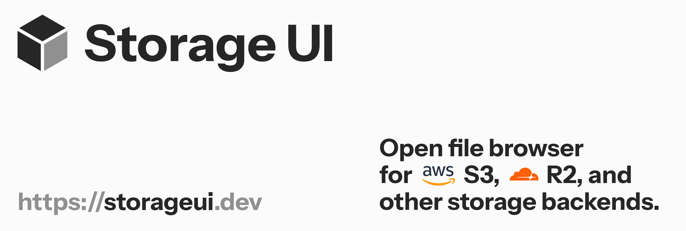

# Storage UI

<p align="start">
  <a href="https://storageui.dev">Website</a> ·
  <a href="https://demo.storageui.dev">Demo</a> ·
  <a href="https://storageui.dev/docs">Documentation</a>
</p>

<p align="start">
  <a href="./README.md"></a>
  <a href="./docs/zh-CN/README.md"></a>
</p>

Open-source file browser for S3, R2, and other storage backends. Browse, preview, search, and manage files in a modern, self-hosted web interface.

## Features

- Icon, list, column, and gallery views
- Search, filtering, sorting, and lazy folder loading
- PDF, DOCX, XLSX, image, text, and code previews
- Multiple storage connections with local persistence
- Per-bucket read-only mode for environment-configured connections
- Responsive layout and dark mode

## Quick Start

### Docker

A prebuilt image is published on Docker Hub. Pull it, then run with your environment variables:

```bash
docker pull hahahumble/storageui

docker run -d \
  --name storage-ui \
  --restart unless-stopped \
  -p 3000:3000 \
  --env-file .env \
  hahahumble/storageui
```

Create a `.env` file with the `STORAGE_1_*` variables (see [`.env.example`](.env.example)) before running.

### Deploy with Vercel

[](https://vercel.com/new/clone?repository-url=https://github.com/hahahumble/storageui)

### Local development

```bash
bun install
cp .env.example .env.local
bun run dev
```

Open `http://localhost:3000`. You can add a storage connection from the UI, or preconfigure server-side buckets by filling the `STORAGE_1_*` variables in `.env.local`.

## License

[Apache-2.0](LICENSE.md)
